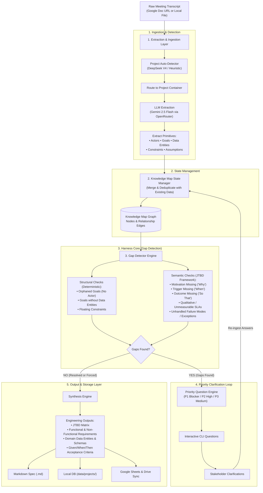

# Requirements Harness System

An automated requirements engineering platform that transforms unstructured meeting transcripts, notes, and Google Docs into rigorous, engineering-ready specifications.

Unlike static summarizers, the Harness System treats requirements as a structured **Knowledge Map graph**, actively analyzes it for missing context or ambiguous requirements using a **Gap Detector**, executes an **interactive clarification loop** with stakeholders, and continuously accumulates knowledge across multiple transcripts into a centralized database and Google Sheets.

---

## Architecture Overview



---

## Key Features

- **Google Doc & Local File Ingestion**: Ingest meeting transcripts directly via Google Docs URLs (authenticated via Drive API or public link) or local text files.
- **Intelligent Project Detection**: Automatically classifies transcripts against existing projects in the registry using LLM classifiers (`deepseek/deepseek-v4-flash`) or domain keyword scoring.
- **Multi-Transcript Knowledge Accumulation**: Primitives (Actors, Goals, Entities, Constraints, Assumptions) merge and deduplicate across calls, maintaining historical project context over time.
- **Harness Core & Gap Detector**:
  - **Structural Verification**: Detects orphaned goals missing actors, goals without data entities, or unattached constraints.
  - **Semantic JTBD Verification**: Enforces Jobs-To-Be-Done completeness: *Situation trigger ("When...")*, *Underlying motivation ("I want to...")*, *Measurable outcome ("So that...")*, and error states.
  - **Quantitative SLAs**: Flags qualitative constraints (e.g. *"must be fast"*) that lack objective metrics.
- **Interactive Question Loop**: Formulates prioritized clarification questions for the stakeholder in the CLI to resolve blockers before synthesis.
- **Engineering-Ready Deliverables**: Generates formal PRDs, JTBD matrices, functional/non-functional requirements, data dictionaries, and `GIVEN / WHEN / THEN` acceptance criteria.
- **Google Sheets Cloud Sync**: Automatically creates and updates project spreadsheets in Google Drive with dedicated tabs for Transcripts, Actors, Goals, Entities, Constraints, and Outputs.

---

## Directory Structure

```text
harness_system/
├── data/
│   └── projects/                  # Local persistent project databases
│       ├── projects_registry.json # Master project registry
│       └── <project_id>/          # Per-project knowledge maps & output history
├── harness/
│   ├── config.py                  # Environment & model routing configuration
│   ├── engine.py                  # Core orchestrator running the evaluation loop
│   ├── gap_detector.py            # Structural & JTBD semantic gap detector
│   ├── gdoc_fetcher.py            # Google Docs text extraction
│   ├── google_auth.py             # Google OAuth2 authentication & token refresh
│   ├── ingestor.py                # LLM & heuristic requirement primitive parser
│   ├── llm_client.py              # OpenRouter API client
│   ├── models.py                  # Domain dataclasses (KnowledgeMap, Actor, Goal, etc.)
│   ├── project_detector.py        # LLM-based project classifier
│   ├── project_registry.py        # Project lifecycle & master index manager
│   ├── question_engine.py         # Priority question generation
│   ├── sheets_api.py              # Google Sheets & Drive REST API synchronization
│   ├── sheets_storage.py          # Local JSON storage & multi-transcript merger
│   └── synthesis.py               # PRD & engineering specification compiler
├── tests/                         # Unit test suite
├── demo.py                        # Standalone demonstration script
├── run_harness.py                 # Interactive CLI runner
└── requirements.txt               # (Standard library only; zero external pip dependencies)
```

---

## Prerequisites & Setup

The Harness System uses Python standard libraries (`urllib`, `dataclasses`, `json`) and requires **zero external pip dependencies**.

### 1. Python Version
Python **3.10+** is recommended.

### 2. Configure Environment Variables
Copy `.env.example` to `.env`:

```bash
cp .env.example .env
```

Configure your OpenRouter API key and model routing in `.env`:
```env
# OpenRouter Configuration
OPENROUTER_API_KEY=your_openrouter_api_key_here
LLM_PROVIDER=openrouter
LLM_MODEL_EXTRACT=google/gemini-2.5-flash
LLM_MODEL_SEMANTIC=deepseek/deepseek-v4-flash
LLM_MODEL_DETECT=deepseek/deepseek-v4-flash

# Storage & Project Settings
LOCAL_STORAGE_DIR=data/projects
```

*(Note: If `OPENROUTER_API_KEY` is omitted, the system seamlessly falls back to local heuristic extraction).*

### 3. (Optional) Google OAuth2 Authentication
For reading private Google Docs or syncing project tabs to Google Sheets:
1. Place your Google Cloud OAuth Client ID credentials in `client_secret.json`.
2. Run the authentication test to generate your token:
   ```bash
   python3 tests/test_google_auth.py
   ```
   This opens your browser, completes Google OAuth, and saves `google_token.json`.

---

## Usage

### 1. Interactive CLI Runner
Run `run_harness.py` against a Google Doc URL or local file:

```bash
# Pass Google Doc URL directly:
python run_harness.py "https://docs.google.com/document/d/YOUR_DOC_ID/edit"

# Or run interactively (it will prompt for the URL):
python run_harness.py

# Or run against a local transcript text file:
python run_harness.py path/to/transcript.txt
```

#### List Registered Projects
```bash
python run_harness.py --list-projects
```

#### Specify an Explicit Target Project
```bash
python run_harness.py transcript.txt --project "Edge Sensors"
```

### 2. Interactive Decision Loop
During execution, the CLI will:
1. **Auto-detect the project** and ask you to confirm or create a new project.
2. **Extract requirement primitives** and merge them with previous transcripts.
3. **Present targeted follow-up questions** if gaps or vague requirements are found:
   - Type your answers to clarify missing actors, motivations, or SLA metrics.
   - Type `skip` to skip a question.
   - Type `force` to auto-fill defaults and proceed immediately to synthesis.
4. **Compile & Save Specification**:
   - Synthesizes the final specification to `synthesized_spec_<project_id>.md`.
   - Saves historical data to `data/projects/<project_id>/`.
   - Synchronizes tabs in Google Sheets if authenticated.

### 3. Standalone Demo
To see the Gap Detector and feedback loop in action without an API key or Google Doc:
```bash
python demo.py
```

---

## Running Tests

Run the full automated test suite:
```bash
python3 -m unittest discover tests
```
